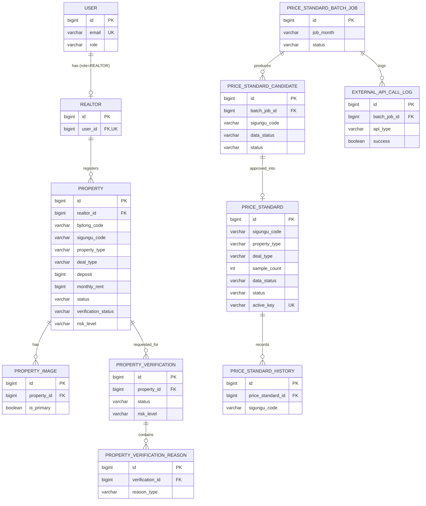

# ERD 인덱스 (집사님)

전체 데이터 모델 한눈에 보기. **정본(컬럼/타입/제약)은 각 차수의 `data-model.md`**, 이 문서는 요약 인덱스다.
현재 **1차 MVP 테이블만 확정**. 2차 이후 테이블은 인벤토리로만 표기.

- MVP 컬럼 상세: [`specs/001-price-verification-mvp/data-model.md`](../specs/001-price-verification-mvp/data-model.md)
- MVP 다이어그램 원본: [`specs/001-price-verification-mvp/erd.md`](../specs/001-price-verification-mvp/erd.md)

---

## 테이블 인벤토리

| 테이블 | 차수 | 상태 | 역할 |
| --- | --- | --- | --- |
| user | 1차 | ✅ | 계정/역할 |
| realtor | 1차 | ✅ | 중개사 프로필 |
| property | 1차 | ✅ | 매물 (bjdong_code+sigungu_code) |
| property_image | 1차 | ✅ | 매물 이미지 |
| property_verification | 1차 | ✅ | 검증 결과/riskLevel |
| property_verification_reason | 1차 | ✅ | 검증 사유(다건) |
| price_standard | 1차 | ✅ | 운영 시세 기준(sigungu, data_status, active_key UK) |
| price_standard_candidate | 1차 | ✅ | 배치 산출 후보 |
| price_standard_history | 1차 | ✅ | 기준 변경 이력 |
| price_standard_batch_job | 1차 | ✅ | 배치 실행 결과 |
| external_api_call_log | 1차 | ✅ | 외부 호출 이력(키 마스킹) |
| visit_slot | 2차 | ⏳ | 방문 슬롯(OPEN/HELD/RESERVED) |
| reservation | 2차 | ⏳ | 방문 예약 |
| payment | 2차 | ⏳ | Mock 결제 |
| refund | 3차 | ⏳ | 환불 |
| settlement | 3차 | ⏳ | 중개사 월별 정산 |
| notification | 4차 | ⏳ | 알림 |
| outbox_event | 4차 | ⏳ | Outbox 이벤트 |
| report | 미배정 | ⏳ | 허위매물 신고 |

---

## 1차 MVP ERD

## 무결성 핵심
- `USER.email` UNIQUE, `REALTOR.user_id` UNIQUE (사용자당 중개사 1개)
- `PRICE_STANDARD.active_key` UNIQUE = `sigungu_code:property_type:deal_type` (ACTIVE 일 때만) → (시군구,유형,거래유형)당 ACTIVE 1건
- 검색 인덱스 `PROPERTY(status, sigungu_code, deal_type, property_type)`
- 지역 코드: `bjdong_code`(10, 정밀) + `sigungu_code`(5, 시세/검증 매칭)

> 컬럼 전체·타입·nullable·enum 값은 정본 `data-model.md` 참조.
