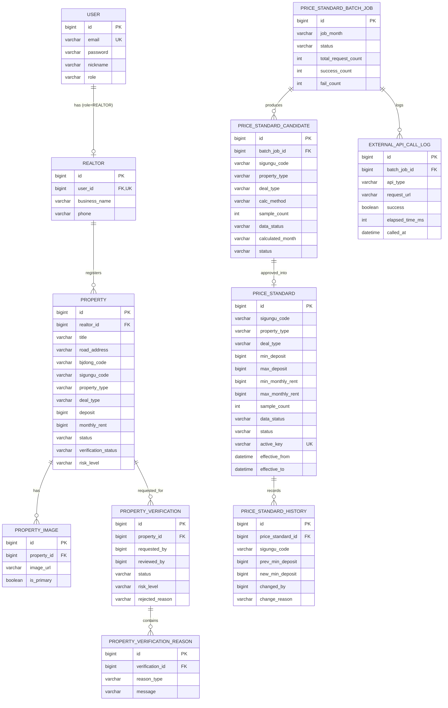

# ERD: 실거래가 기반 시세 검증 MVP

컬럼 상세/타입/제약은 `data-model.md` 기준. 여기서는 관계 구조를 시각화한다.
(VisitSlot/Reservation/Payment 등 예약·결제는 2차 이후 — 본 ERD에는 미포함)

## 관계 해설
- **USER — REALTOR**: 1:0..1. REALTOR 역할 사용자만 realtor 프로필을 가진다.
- **REALTOR — PROPERTY**: 1:N. 중개사가 매물을 등록.
- **PROPERTY — PROPERTY_VERIFICATION**: 1:N. submit 마다 검증 이력 1건(재요청 시 누적).
- **PROPERTY_VERIFICATION — REASON**: 1:N. 검증 사유(reasonType) 다건.
- **BATCH_JOB — CANDIDATE / CALL_LOG**: 1:N. 한 배치 실행이 여러 후보·호출로그 생성.
- **CANDIDATE → PRICE_STANDARD**: 후보 승인 시 신규 ACTIVE 1건 생성(`active_key` UNIQUE로 (지역,유형,거래유형)당 ACTIVE 1건).
- **PRICE_STANDARD — HISTORY**: 1:N. 기준 교체 시 이전/신규 값 이력.

## 무결성 포인트
- `PRICE_STANDARD.active_key` UNIQUE → 동일 (region, type, deal) ACTIVE 중복 방지 (plan D3).
- `REALTOR.user_id` UNIQUE → 사용자당 중개사 프로필 1개.
- `USER.email` UNIQUE.
- 검색 인덱스: `PROPERTY(status, sigungu_code, deal_type, property_type)`.
- `PRICE_STANDARD.active_key` = `sigungu_code:property_type:deal_type` (ACTIVE 일 때만).
